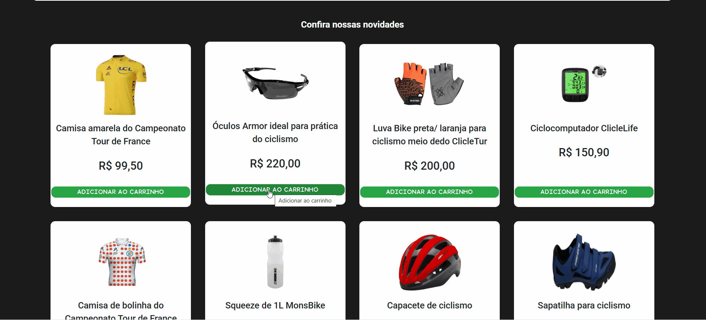

  <h2>1. Visão Geral do Projeto</h2>
        

            O projeto <strong>Click & Buy</strong> é uma loja online de produtos para ciclismo. Ele permite que os usuários visualizem produtos, adicionem itens ao carrinho, visualizem o carrinho e finalizem a compra. O carrinho é persistente, ou seja, os itens não são perdidos ao atualizar a página, graças ao uso do <code>localStorage</code>.
        

        <h2> 2. Estrutura do Projeto</h2>
        
A estrutura do projeto é organizada da seguinte forma:

        <pre>
e-commerce/
├── index.html                  # Main HTML file for the homepage
├── login.html                  # HTML file for the login page (inferred from header.html)
├── product-details.html        # HTML file for product details page (inferred from search.js)
├── src/
│   ├── css/                    # CSS Stylesheets
│   │   ├── header.css          # Styles for the header section
│   │   ├── news.css            # Styles for the news/products section
│   │   ├── footer.css          # Styles for the footer section
│   │   ├── product.css         # Styles for product display sections
│   │   ├── promotion.css       # Styles for promotional sections
│   │   ├── search.css          # Styles for search results
│   │   ├── responsive.css      # Media queries for responsive design
│   │   ├── reset.css           # CSS reset for consistent styling
│   │   ├── globais.css         # Global styles and variables
│   │   ├── variables.css       # CSS variables for theming
│   │   └── login.css           # Styles for the login page
│   ├── images/                 # Image Assets
│   │  
│   └── js/                     # JavaScript Files
│       ├── header.js           # JavaScript for header interactions
│       ├── carrinho.js         # JavaScript for cart functionality
│       ├── carousel.js         # JavaScript for the image carousel
│       └── search.js           # JavaScript for search functionality
├── package.json                # (Likely) Project metadata and dependencies (not provided, but standard)
└── README.md                   # (Likely) Project description and instructions (not provided, but standard)

        
</pre>
        <h2>3. Funcionalidades</h2>
        <ul>
            <li><strong>Listagem de Produtos</strong>:
                <ul>
                    <li>Exibe uma lista de produtos com nome, preço e imagem.</li>
                    <li>Permite adicionar produtos ao carrinho.</li>
                </ul>
            </li>
            <li><strong>Página de Detalhes do Produto</strong>:
                <ul>
                    <li>Exibe detalhes de um produto específico.</li>
                    <li>Permite adicionar o produto ao carrinho.</li>
                </ul>
            </li>
            <li><strong>Carrinho de Compras</strong>:
                <ul>
                    <li>Exibe os produtos adicionados ao carrinho.</li>
                    <li>Permite remover produtos do carrinho.</li>
                    <li>Calcula o total da compra.</li>
                    <li>Persiste os dados do carrinho no <code>localStorage</code>.</li>
                </ul>
            </li>
            <li><strong>Finalização da Compra</strong>:
                <ul>
                    <li>Exibe um alerta com o total da compra.</li>
                    <li>Limpa o carrinho após a finalização.</li>
                </ul>
            </li>
        </ul>
        <h2>4. Tecnologias Utilizadas</h2>
        <ul>
            <li><strong>HTML5</strong>: Estrutura das páginas.</li>
            <li><strong>CSS3</strong>: Estilização das páginas.</li>
            <li><strong>JavaScript</strong>: Funcionalidades dinâmicas, como adicionar/remover produtos e persistência do carrinho.</li>
            <li><strong>Bootstrap</strong>: Framework CSS para estilização responsiva.</li>
            <li><strong>Font Awesome</strong>: Ícones utilizados no projeto.</li>
            <li><strong>Google Fonts</strong>: Fontes personalizadas (Roboto e Manrope).</li>
        </ul>
        <h2>5. Instruções de Uso</h2>
        <h3>Como Executar o Projeto</h3>
        <ol>
            <li><strong>Clone o repositório</strong>:
                <pre><code>git clone https://github.com/seu-usuario/click-and-buy.git</code></pre>
            </li>
            <li><strong>Abra o projeto</strong>:
                <ul>
                    <li>Navegue até a pasta do projeto e abra o arquivo <code>index.html</code> no navegador.</li>
                </ul>
            </li>
            <li><strong>Navegue pelo site</strong>:
                <ul>
                    <li>Na página inicial, clique em um produto para ver os detalhes.</li>
                    <li>Adicione produtos ao carrinho e visualize o carrinho clicando no ícone do carrinho no cabeçalho.</li>
                </ul>
            </li>
        </ol>
        <h2>6. Estrutura do Código</h2>
        <h3>HTML</h3>
        <ul>
            <li><strong><code>index.html</code></strong>:
                <ul>
                    <li>Contém a listagem de produtos.</li>
                    <li>Cada produto tem um botão "Adicionar ao carrinho".</li>
                </ul>
            </li>
            <li><strong><code>product-details.html</code></strong>:
                <ul>
                    <li>Exibe os detalhes de um produto específico.</li>
                    <li>Permite adicionar o produto ao carrinho.</li>
                </ul>
            </li>
        </ul>
        <h3>CSS</h3>
        <ul>
            <li><strong><code>reset.css</code></strong>: Reseta os estilos padrão do navegador.</li>
            <li><strong><code>globais.css</code></strong>: Estilos globais aplicados em todo o site.</li>
            <li><strong><code>header.css</code></strong>: Estilos específicos para o cabeçalho.</li>
            <li><strong><code>product-details.css</code></strong>: Estilos para a página de detalhes do produto.</li>
            <li><strong><code>footer.css</code></strong>: Estilos para o rodapé.</li>
            <li><strong><code>responsive.css</code></strong>: Estilos para tornar o site responsivo.</li>
        </ul>
        <h3>JavaScript</h3>
        <ul>
            <li><strong><code>carrinho.js</code></strong>:
                <ul>
                    <li>Gerencia a lógica do carrinho (adicionar, remover, atualizar e finalizar compra).</li>
                    <li>Persiste os dados do carrinho no <code>localStorage</code>.</li>
                </ul>
            </li>
            <li><strong><code>product-details.js</code></strong>:
                <ul>
                    <li>Carrega os detalhes do produto com base no ID da URL.</li>
                </ul>
            </li>
        </ul>
         <h2>7. Capturas de Tela</h2>
        

            Aqui estão algumas capturas de tela do projeto para que você possa ter uma ideia de como ele se parece:
        

        

            

            
Página inicial:

                
                
Página inicial mobile

                
                
Funcionamento da página

                
            

        <h2>8. Explicação das Funções</h2>
        <h3>Funções Principais em <code>carrinho.js</code></h3>
        <ul>
            <li><strong><code>carregarCarrinho()</code></strong>:
                <ul>
                    <li>Carrega o carrinho salvo no <code>localStorage</code> ao carregar a página.</li>
                    <li>Atualiza a interface com os produtos e o total.</li>
                </ul>
            </li>
            <li><strong><code>salvarCarrinho()</code></strong>:
                <ul>
                    <li>Salva o carrinho atual no <code>localStorage</code>.</li>
                </ul>
            </li>
            <li><strong><code>adicionarItem(button)</code></strong>:
                <ul>
                    <li>Adiciona um produto ao carrinho.</li>
                    <li>Atualiza o total e o contador de itens.</li>
                    <li>Salva o carrinho no <code>localStorage</code>.</li>
                </ul>
            </li>
            <li><strong><code>removerItem(id)</code></strong>:
                <ul>
                    <li>Remove um produto do carrinho com base no ID.</li>
                    <li>Atualiza o total e o contador de itens.</li>
                    <li>Salva o carrinho no <code>localStorage</code>.</li>
                </ul>
            </li>
            <li><strong><code>atualizarCarrinho()</code></strong>:
                <ul>
                    <li>Atualiza a lista de produtos no carrinho na interface.</li>
                </ul>
            </li>
            <li><strong><code>finalizarCompra()</code></strong>:
                <ul>
                    <li>Exibe um alerta com o total da compra.</li>
                    <li>Limpa o carrinho e o <code>localStorage</code>.</li>
                </ul>
            </li>
        </ul>
        <h2>9. Como Contribuir</h2>
        
Se você deseja contribuir para o projeto, siga os passos abaixo:

        <ol>
            <li><strong>Faça um fork do repositório</strong>:
                <ul>
                    <li>Clique em "Fork" no canto superior direito da página do repositório.</li>
                </ul>
            </li>
            <li><strong>Clone o repositório forkado</strong>:
                <pre><code>git clone https://github.com/seu-usuario/click-and-buy.git</code></pre>
            </li>
            <li><strong>Crie uma branch para sua feature</strong>:
                <pre><code>git checkout -b minha-feature</code></pre>
            </li>
            <li><strong>Faça as alterações e commit</strong>:
                <pre><code>git add .
git commit -m "Adicionando nova funcionalidade"</code></pre>
            </li>
            <li><strong>Envie as alterações</strong>:
                <pre><code>git push origin minha-feature</code></pre>
            </li>
            <li><strong>Abra um Pull Request</strong>:
                <ul>
                    <li>Vá até o repositório original e clique em "New Pull Request".</li>
                    <li>Descreva suas alterações e envie o PR.</li>
                </ul>
            </li>
        </ol>
        <h2>10. Exemplo de Uso</h2>
        <h3>Adicionar um Produto ao Carrinho</h3>
        <ol>
            <li>Na página inicial, clique no botão "Adicionar ao carrinho" de um produto.</li>
            <li>O produto será adicionado ao carrinho, e o contador no cabeçalho será atualizado.</li>
        </ol>
        <h3>Remover um Produto do Carrinho</h3>
        <ol>
            <li>Abra o carrinho clicando no ícone do carrinho no cabeçalho.</li>
            <li>Clique no ícone de lixeira ao lado do produto que deseja remover.</li>
            <li>O produto será removido do carrinho, e o total será atualizado.</li>
        </ol>
        <h3>Finalizar a Compra</h3>
        <ol>
            <li>Abra o carrinho.</li>
            <li>Clique em "Finalizar compra".</li>
            <li>Um alerta será exibido com o total da compra, e o carrinho será limpo.</li>
        </ol>
        <h2>11. Considerações Finais</h2>
        

            Este projeto é uma demonstração de como criar uma loja online simples com funcionalidades básicas de carrinho de compras. Ele pode ser expandido com novas funcionalidades, como integração com um backend, autenticação de usuários e pagamento online.
        

        
 Um projeto realizado por Andre Krykhtine (https://github.com/Andrekrykhtine) e Álvaro Alves (https://github.com/alvaro-asouza). 

        

            Se tiver dúvidas ou sugestões, sinta-se à vontade para entrar em contato! 😊
        

    
